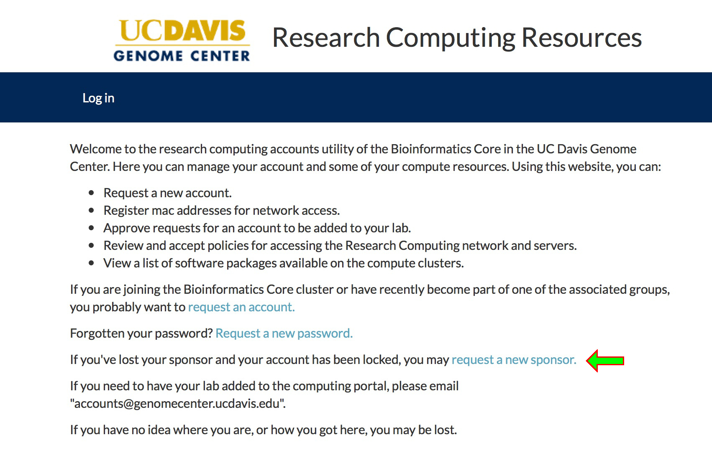

# Computing Portal

- Request users accounts
- Manage groups/labs/access
- Request software installation
- Request Sys Admin Support
- View slurm/priority etc.
- View/request shared storage

Access at https://computing.genomecenter.ucdavis.edu/

# Computing Portal

# Account registration

# Account registration

# Account registration

- Your sponsor is your primary lab.  You can be a member of more than one
  lab, but only one can be your primary.
- If you've never had a Genome Center account, click on "request an account."
- If you have previously had a Genome Center account (even for a class or 
  workshop), you do not need to request a new one, simply request a new 
  sponsor.
- Your requested sponsor will get an email to approve the request and once 
  it is approved, you may complete the registration process.

# Password reset

If you have forgotten your password (or it has expired), you can request
a reset via the portal.  An approver in your lab will need to review and
approve your request.

# Group Memberships

- Unix group vs. SLURM account
- Primary group vs. additional groups
- Manage group membership via portal

# Requests

# Storage

| Area | Access | Performance |
|------|--------|-------------|
| home | widest | lowest      |
| lab share | local to cluster | faster |
| scratch | local to node | best |

# home directory

- personal space 
- widest access, but slowest performance
- If you change labs, your home will remain the same

# lab share

- Organization up to individual lab (per user/per project/etc)
- Project data
- Lab software installs
- Upon request of the lab owner, we will reset permissions so the whole
  lab may access.

# Local scratch
- Usually best performance
- Not shared between nodes
- May be deleted

# Shared resources

- Genomes – some genomes and mapping indexes (star/bwa/bowtie) are 
  available centrally to be used by everyone, they can be found under
  `/share/genomes`

    - Ensembl
    - genome_reference_consortium 
    - Igenomes
    - Kraken
    - ncbi
    - ncbi_genomes 
    - patric

# Home directory

To use your home directory, you will need to be authenticated to the
fileserver.  This happens automatically on login but for security reasons
access tokens have a finite lifetime.  If you need to renew your token
(for example if you are using screen/tmux), use the following commands:

   `kinit`

   `aklog`

- Access to your home is not authenticated by default on the compute nodes.
(This is a bug in SLURM that we hope to fix).  As a workaround, add the
`aklog` command to the top of your job script if you need to use your home.

- We strongly recommend using the lab share instead for your jobs.

- User home directories are ‘personal’ space, special permission must be 
given by university administration to explore a user’s home directory

# Lab share

- Each lab has a lab share, mounted under `/share/PIlab`.  Most shares
are not backed up, but backed up shares are made on request.  You can see
what shares you have access to using the portal.
- Lab shares are writable by all members of the lab.  Care should be taken
to avoid overwriting others' data.
- We use the setgid bit to ensure that new files and directories created in
the share inherit the lab group.
- We will, on request, reset permissions to group write access

# Recommendations

- Use the lab share for all data/job logs/software installs
- Using local scratch on the node can provide substantial performance gains

