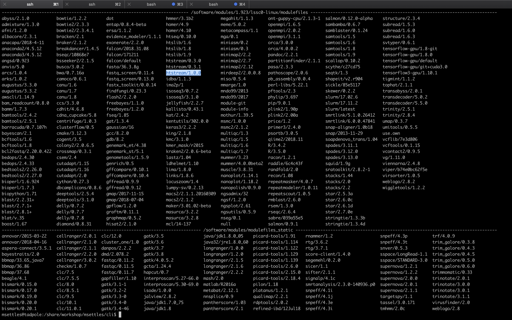

# Environment Module system

- The Environment Modules package provides for the dynamic modification of 
  a user's environment via module files.
- Each module file contains the information needed to configure the shell
  for an application. Once the Modules package is initialized, the 
  environment can be modified on a per-module basis using the module command 
  which interprets module files. Typically module files instruct the module 
  command to alter or set shell environment variables such as PATH, MANPATH, 
  etc. module files may be shared by many users on a system and users may 
  have their own collection to supplement or replace the shared module files.
- Modules are useful in managing different versions of applications. 
  Modules can also be bundled into meta-modules that will load an entire 
  suite of different applications, or ensure dependencies are loaded.

## Environment modules

Environment modules are used by invoking the 'module' command and its sub-commands. You will NOT find the 'module' command on all linux computers. Using modules is generally something that is used on a shared system (like clusters) and generally installed by the system's administrator. The module system allows you to only 'load' software when needed as well as to make multiple versions of software available at the same time. It basically changes your PATH variable (and possibly other environment variables) so that the shell searches the correct directories for the software you want to use. First, take a look at all the software available on our system:

    module avail

This is a list of all the software (with different versions) that you can access. The format of 'modules' is "software/version". Currently, you can see that htstream has 8 different versions installed with the latest being 1.3.3. When you load a module without specifying a version, it will load the default (generally the latest) version. If you need an older version, you need to use the corresponding version number:

Now let's try running the 'hts_Stats' app from htstream:

    hts_Stats

joshi@barbera:~$ hts_Stats
-bash: hts_Stats: command not found

You should get an error saying that the command was not found. Take a look at your PATH variable.

    echo $PATH

joshi@barbera:~$ echo $PATH
/software/slurm/17.11.2/lssc0-linux/sbin:/software/slurm/17.11.2/lssc0-linux/bin:/software/modules/1.923/lssc0-linux/bin:/usr/local/sbin:/usr/local/bin:/usr/sbin:/usr/bin:/sbin:/bin:/usr/games:/usr/local/games:/snap/bin:/opt/puppetlabs/bin

These are the directories (colon separated) that are searched for executable applications to run on the command-line. In order to access a piece of software that is not in one of these default directories, we need to use the 'module load' command, or set the PATH to locate it:

    module load htstream/1.3.3
    hts_Stats

Use the 'which' command to find out where the 'hts_Stats' command is actually located:

    which hts_Stats

You'll see that hts_Stats is located in a completely different place and yet you are able to access it. This is because the module command changes your PATH variable so that it has the correct directory. Take a look at your PATH again:

    echo $PATH

You'll see that the directory for htstream has been added to PATH.

---

A few more module sub-commands that are useful:

'module list' will list all of your currently loaded modules in this terminal/session.

    module list

joshi@barbera:~$ module list
Currently Loaded Modulefiles:
 1) slurm/latest   2) htstream/1.0.0

'module unload' will unload the module(s) you specify.

    module load star
    module load samtools
    module list
    module unload star
    module list

joshi@springfield:/share/biocore/joshi/projects$ module load star
Module star-2.7.9a-lssc0-linux loaded. STAR (Spliced Transcripts Alignment to a Reference) is an RNA-seq data aligner. NOTE: Indices must be indexed using this version or newer, they cannot be from a previous version.
---
joshi@springfield:/share/biocore/joshi/projects$ module load samtools
Module samtools-1.15.1-lssc0-linux loaded. Samtools is a suite of programs for interacting with high-throughput sequencing data.
---
joshi@springfield:/share/biocore/joshi/projects$ module list
Currently Loaded Modulefiles:
 1) slurm/latest   2) htstream/1.3.3   3) star/2.7.9a   4) samtools/1.15.1  
joshi@springfield:/share/biocore/joshi/projects$ module unload star
joshi@springfield:/share/biocore/joshi/projects$ module list
Currently Loaded Modulefiles:
 1) slurm/latest   2) htstream/1.3.3   3) samtools/1.15.1  
joshi@springfield:/share/biocore/joshi/projects$ 

'module purge' will unload all of your modules. Which simply means that it will take out the directories for all of the modules from your PATH variable. Take a look at $PATH now:

    echo $PATH
    module purge
    module list
    echo $PATH

joshi@springfield:/share/biocore/joshi/projects$ echo $PATH
/software/samtools/1.15.1/lssc0-linux/bin:/software/htstream/1.3.3/lssc0-linux/bin:/software/slurm/20.11.9/lssc0-linux/sbin:/software/slurm/20.11.9/lssc0-linux/bin:/software/modules/1.923/lssc0-linux/bin:/usr/local/sbin:/usr/local/bin:/usr/sbin:/usr/bin:/sbin:/bin:/usr/games:/usr/local/games:/opt/puppetlabs/bin:.
joshi@springfield:/share/biocore/joshi/projects$ module purge
joshi@springfield:/share/biocore/joshi/projects$ module list
No Modulefiles Currently Loaded.
joshi@springfield:/share/biocore/joshi/projects$ echo $PATH
/software/modules/1.923/lssc0-linux/bin:/usr/local/sbin:/usr/local/bin:/usr/sbin:/usr/bin:/sbin:/bin:/usr/games:/usr/local/games:/opt/puppetlabs/bin:.
joshi@springfield:/share/biocore/joshi/projects$ 

